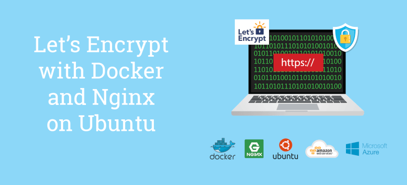
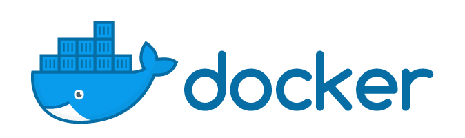
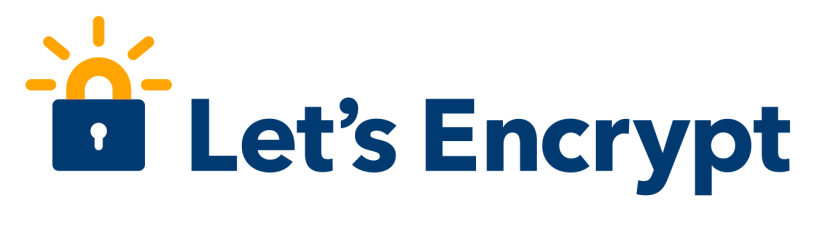
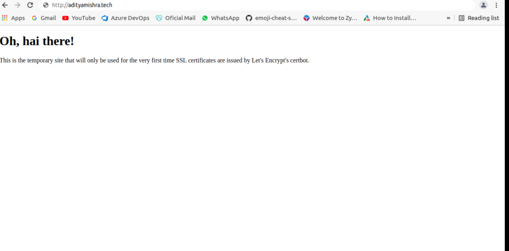
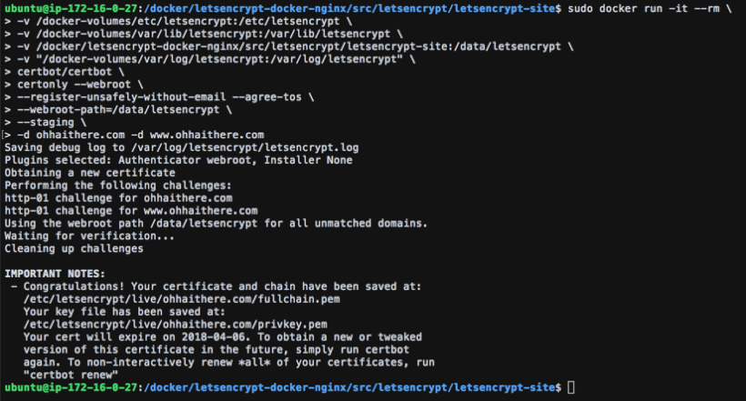
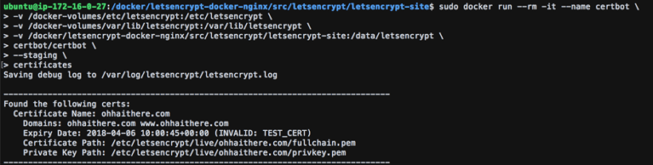
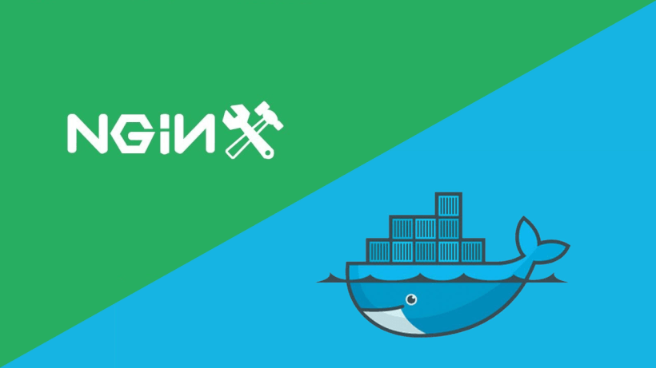
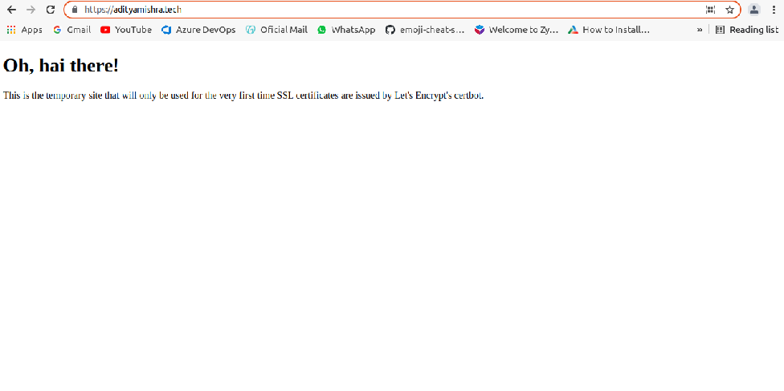

# How to Set Up Free SSL Certificates from Let's Encrypt using Docker and Nginx

### *The Complete Guide to Automating Certbot using Docker, Nginx and Ubuntu on a Virtual Machine in the Cloud* 

 >Before we continue, let's look at what I'll be covering in this post:

* How to install Docker on Ubuntu
* How to set up and run Nginx in a Docker container
* How to set up and run Certbot in a Docker container, and how to get Certbot to issue an SSL/TLS certificate for a new domain
* How to configure Nginx to use your SSL certificate
* How to run a cronjob so that Certbot will automatically renew your SSL/TLS certificate

## Running an Ubuntu Server 16.04 VM on AWS or Azure

*To get a VM up and running as a Web Server, at least for the purposes of this post, you need to ensure the following:*

* You have a registered domain
* You have set up a static public IP address for your server
* You have pointed your Domain's A and CNAME records to the server's public IP address
* You have opened HTTP, HTTPS and SSH ports
* You're running Ubuntu Server
Know how to SSH into your server

#### Install Docker on Ubuntu

*SSH into your server and run the following commands to install Docker on Ubuntu.*

*Add the GPG key and add the Docker repository from APT sources*

	curl -fsSL https://download.docker.com/linux/ubuntu/gpg | sudo apt-key add -

	sudo add-apt-repository "deb [arch=amd64] https://download.docker.com/linux/ubuntu $(lsb_release -cs) stable"

#### Update the Ubuntu package database

	sudo apt-get update

####  And finally, install Docker

	sudo apt-get install -y docker-ce

#### Install Docker Compose on Ubuntu
Docker Compose is used to orchestrate and run multiple containers together.

###### Get the latest version of Docker Compose and install it

	sudo curl -L https://github.com/docker/compose/releases/download/1.18.0/docker-compose-`uname -s`-`uname -m` -o /usr/local/bin/docker-compose

###### Set execute permissions for Docker Compose

	sudo chmod +x /usr/local/bin/docker-compose

As far as the server installation is concerned, that's really all there is to it. Spinning up a new Ubuntu instance and installing docker can literally be done in less than 5 minutes.

#### A Quick Overview of the Let's Encrypt Certificate Issuance Process

Before I proceed, it's important to step back and understand how the process works on a high level.

Let's Encrypt is an open, not for profit and free Certificate Authority (CA). This means that they issue free SSL/TLS certificates. In addition to this, they provide software that can issue the certificates and renew certificates automatically. The software that manages this process is called Certbot, and usually, you would install this on your server.

#### The process for obtaining a free Let's Encrypt certificate is a 3-part process:

1. Install Certbot on your server
2. Run Certbot with a command to obtain your SSL/TLS certificate and save it on your server. The Certificate is valid for 3 months and thus needs to be renewed every 3 months.
3. Set up a cron job (scheduler) to run Certbot with a Certbot renew command on a weekly basis. When the cron job runs and there are less than 30 days remaining until your certificate expires, the certificate will renew.

### A Better Solution: Run Let's Encypt's Certbot in a Docker Container

#### By dockerizing Certbot, the process for obtaining Let's Encrypt certificates will now only consist of 2 parts:

1. To obtain the first Let's Encrypt SSL/TLS certificate, simply execute a Docker run script. This script will look very similar to the script that you would run natively on a server through Certbot but instead is passed through Docker. Docker will launch an instance of Certbot in a container and run the script, and if the script is finished, the container will close.

2. Set up a cron job that will execute another Docker run script on a periodic basis. The script will look almost identical to the one in the first step, give or take a parameter or two.

*By running Certbot in a Docker container, we no longer need to be concerned with maintaining the Certbot agent software. If a new version is released, a new image will download and run the next time the Docker container instance launches. Simple and automated.*

### How to Dockerize Certbot

**Before we can execute the Certbot command that installs a new certificate, we need to run a very basic instance of Nginx so that the domain `adityamishra.tech` is accessible over HTTP.**

##### In order for Let's Encrypt to issue you a certificate, an ACME Challenge Request is performed:

1. You issue a command to the Certbot agent

2. Certbot informs Let's Encrypt that you want an SSL/TLS certificate

3. Let's Encrypt sends the Certbot agent a unique token

4. The Certbot agent places the token at an endpoint on your domain that looks like h`ttp://adityamishra.tech/`.well-known/acme-challenge/{token}

5. If the token at the endpoint matches the token that was sent to the Certbot agent from the Let's Encrypt CA, the challenge request was successful and Let's Encrypt knows that you are in control of the domain.

#####  The very first request for a Let's Encrypt certificate will involve the following:

1. Configure a basic version of Nginx that only runs on HTTP and gives the Certbot agent write access for the following endpoint: `http://adityamishra.tech/`.well-known/acme-challenge/{token}

2. Spin up the basic container of Nginx via Docker Compose

3. Execute a Docker run command that will spin up the Certbot agent. The Certbot agent will perform the challenge request, and if successful, place your SSL certificates in a Let's Encrypt folder on your server.

4. Once the Certbot agent process is complete, the container will automatically stop

5. Issue a Docker Compose down command which will stop and close down your basic version of Nginx container

## Set up Docker, Nginx and Certbot To Obtain Your First Let's Encrypt SSL/TLS Certificate

###### On your Host server, create a new Directory:
	
	sudo mkdir -p /docker/letsencrypt-docker-nginx/src/letsencrypt/letsencrypt-site

 
 ###### Then, create a new docker-compose.yml file

	 sudo vim /docker/letsencrypt-docker-nginx/src/letsencrypt/docker-compose.yml

 `docker-compose.yml`
 
 	version: '3.1'
	
	 services:
	 
	 letsencrypt-nginx-container:
    container_name: 'letsencrypt-nginx-container'
    image: nginx:latest
    ports:
      - "80:80"
    volumes:
      - ./nginx.conf:/etc/nginx/conf.d/default.conf
      - ./letsencrypt-site:/usr/share/nginx/html
    networks:
      - docker-network
	 networks:
 	 docker-network:
    driver: bridge

##### The docker-compose.yml file does the following:

* Pulls the latest version of Nginx from the Docker registry

* Exposes port 80 on the container to port 80 on the host, which means that requests to your domain on port 80 will be forwarded to nginx running in the Docker container

* Maps the nginx configuration file that we will create in the next step to the configuration location in the Nginx container. When the container starts, it will load our custom configuration

* Maps the /docker/letsencrypt-docker-nginx/src/letsencrypt/letsencrypt-site location to the default location of Nginx in the container. In this instance, it's not really necessary, as the site only needs to be used for the purposes of a challenge request, but it's always good to place a default HTML file for troubleshooting purposes.

* Creates a default Docker network

######  Then, create a configuration file for nginx

	sudo cim /docker/letsencrypt-docker-nginx/src/letsencrypt/nginx.conf
	

`nginx.conf`

	server {
     listen 80;
     listen [::]:80;
     server_name www.adityamishra.tech;

    location ~ /.well-known/acme-challenge {
        allow all;
        root /usr/share/nginx/html;
    }

    root /usr/share/nginx/html;
    index index.html;
	}
			
			

##### The nginx configuration file does the following:

* Listens for requests on port 80 for URLs ohhaithere.com and www.adityamishra.tech

* Gives the Certbot agent access to ./well-known/acme-challenge
 
* Sets the default root and file

###### Next, create an index.html file

	sudo vim /docker/letsencrypt-docker-nginx/src/letsencrypt/letsencrypt-site/index.html
	

`index.html`

	<!DOCTYPE html>
	<html>
	<head>
    		<meta charset="utf-8" />
    		<title>Let's Encrypt First Time Cert Issue Site</title>
	</head>
	<body>
    		<h1>Oh, hai there!</h1>
   		 

        This is the temporary site that will only be used for the very first time SSL certificates are issued by Let's Encrypt's
        certbot.
    		

	</body>
	</html>

Before running the Certbot command, spin up a Nginx container in Docker to ensure the temporary Nginx site is up and running

	cd /docker/letsencrypt-docker-nginx/src/letsencrypt
	sudo docker-compose up -d

Then, open up a browser and visit the domain to ensure that the Docker container is up and running and accessible. As stated earlier, it's not necessary to have a default index.html page for this container, but it makes testing the container a lot easier, so I always create one.

*The Site Running in the Nginx Docker Container for Generating the First Let's Encrypt Certificate*

We're almost ready to execute the Certbot command. But before we do, you need to be aware that Let's Encrypt has rate limits. Most notably, there's a limit of 20 issued certificates per 7 days. So if you exceeded 20 requests and are having a problem with generating your certificate for whatever reason, you could run into trouble. Therefore, it's always wise to run your commands with a --staging parameter which will allow you to test if your commands will execute properly before running the actual commands.

###### Run the staging command for issuing a new certificate:

	sudo docker run -it --rm \
	-v /docker-volumes/etc/letsencrypt:/etc/letsencrypt \
	-v /docker-volumes/var/lib/letsencrypt:/var/lib/letsencrypt \
	-v /docker/letsencrypt-docker-nginx/src/letsencrypt/letsencrypt-site:/data/letsencrypt \
	-v "/docker-volumes/var/log/letsencrypt:/var/log/letsencrypt" \
	certbot/certbot \
	certonly --webroot \
	--register-unsafely-without-email --agree-	tos \
	--webroot-path=/data/letsencrypt \
	--staging \
	-d adityamishra.tech-d www.adityamishra.tech
	
	

After executing the above command, you should get the following output which should indicate everything ran successfully.

*Issue a new Let's Encrypt Certificate with Certbot and Docker in Staging Mode*

##### The command does the following:

* Run docker in interactive mode so that the output is visible in terminal

* If the process is finished close, stop and remove the container

* Map 4 volumes from the server to the Certbot Docker Container:

	* The Let's Encrypt Folder where the certificates will be saved
	* Lib folder
	
	* Map our html and other pages in our site folder to the data folder that let's encrypt will use for challenges.
	
	* Map a logging path for possible troubleshooting if needed

* For staging, we're not specifying an email address

* We agree to terms of service

* Specify the webroot path

* Run as staging

* Issue the certificate to be valid for the A record and the CNAME record

###### You can also get some additional information about certificates for your domain by running the Certbot certificates command:

	sudo docker run --rm -it --name certbot \
	-v /docker-volumes/etc/letsencrypt:/etc/letsencrypt \
	-v /docker-volumes/var/lib/letsencrypt:/var/lib/letsencrypt \
	-v /docker/letsencrypt-docker-nginx/src/letsencrypt/letsencrypt-site:/data/letsencrypt \
	certbot/certbot \
	--staging \
	certificates
	
	
	

*Get Additional Information with the Certbot Certificates Command*

If the staging command executed successfully, execute the command to return a live certificate

###### First, clean up staging artifacts:

	sudo rm -rf /docker-volumes/
	
	

###### And then request a production certificate: 
>(note that it's a good idea to supply your email address so that Let's Encrypt can send expiry notifications)

	sudo docker run -it --rm \
	-v /docker-volumes/etc/letsencrypt:/etc/letsencrypt \
	-v /docker-volumes/var/lib/letsencrypt:/var/lib/letsencrypt \
	-v /docker/letsencrypt-docker-nginx/src/letsencrypt/letsencrypt-site:/data/letsencrypt \
	-v "/docker-volumes/var/log/letsencrypt:/var/log/letsencrypt" \
	certbot/certbot \
	certonly --webroot \
	--email youremail@domain.com --agree-tos --no-eff-email \
	--webroot-path=/data/letsencrypt \
	-d ohhaithere.com -d www.adityamishra.tech

If everything ran successfully

###### run a docker-compose down command to stop the temporary Nginx site

	cd /docker/letsencrypt-docker-nginx/src/letsencrypt

	sudo docker-compose down

### Set up Your Production Site to Run in a Nginx Docker Container

###### Create the directories for our production site

	sudo mkdir -p /docker/letsencrypt-docker-nginx/src/production/production-site
	sudo mkdir -p /docker/letsencrypt-docker-nginx/src/production/dh-param

###### Let's start with the docker-compose.yml file

`docker-compose.yml`

	version: '3.1'

	services:

	  production-nginx-container:
    container_name: 'production-nginx-container'
    image: nginx:latest
    ports:
      - "80:80"
      - "443:443"
    volumes:
      - ./production.conf:/etc/nginx/conf.d/default.conf
      - ./production-site:/usr/share/nginx/html
      - ./dh-param/dhparam-2048.pem:/etc/ssl/certs/dhparam-2048.pem
      - /docker-volumes/etc/letsencrypt/live/ohhaithere.com/fullchain.pem:/etc/letsencrypt/live/ohhaithere.com/fullchain.pem
      - /docker-volumes/etc/letsencrypt/live/ohhaithere.com/privkey.pem:/etc/letsencrypt/live/ohhaithere.com/privkey.pem
    networks:
      - docker-network

	networks:
	  docker-network:
    driver: bridge

 		

##### The docker-compose does the following:

* Allows ports 80 and 443

* Maps the production Nginx configuration file into the container

* Maps the production site content into the container

* Maps a 2048 bit Diffie–Hellman key exchange file into the container

* Maps the public and private keys into the container

* Sets up a docker network

###### Next, create the Nginx configuration file for the production site

	sudo vim /docker/letsencrypt-docker-nginx/src/production/production.conf

`production.conf`

	#https://adityamishra.tech
	server {
    		server_name adityamishra.tech;
    		listen 443 ssl;
		# listen [::]:443 ssl http2;

    		#server_tokens off;

    		ssl on;

    		ssl_buffer_size 8k;
    		ssl_dhparam /etc/ssl/certs/dhparam-2048.pem;

    		ssl_protocols TLSv1.2 TLSv1.1 TLSv1;
    		ssl_prefer_server_ciphers on;
    		ssl_ciphers ECDH+AESGCM:ECDH+AES256:ECDH+AES128:DH+3DES:!ADH:!AECDH:!MD5;

    		ssl_ecdh_curve secp384r1;
    		ssl_session_tickets off;

    		# OCSP stapling

    		ssl_certificate /etc/letsencrypt/live/adityamishra.tech/fullchain.pem;
    		ssl_certificate_key /etc/letsencrypt/live/adityamishra.tech/privkey.pem;

    		root /usr/share/nginx/html;
    		index index.html;
			}
	server {
         listen 80;
         server_name adityamishra.tech;
         return 301 https://adityamishra.tech;
       }

###### Generate a 2048 bit DH Param file

	sudo openssl dhparam -out /docker/letsencrypt-docker-nginx/src/production/dh-param/dhparam-2048.pem 2048					

###### Copy your site content into the mapped directory:

	/docker/letsencrypt-docker-nginx/src/production/production-site/

###### Spin up the production site in a Docker container:

	cd /docker/letsencrypt-docker-nginx/src/production
	sudo docker-compose up -d

*If you open up a browser and point to* `http://www.adityamishra.tech`, *you should see that the site loads correctly and will automatically redirect to* `https://www.adityamishra.tech`

The Production Website Running in an Nginx Docker Container with a Let's Encrypt SSL/TLS Certificate

